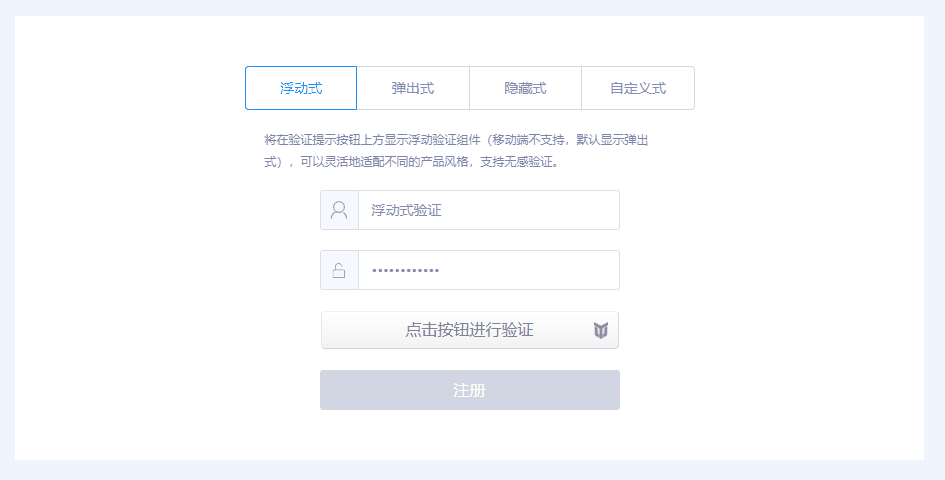

## YoTest-React-SDK 文档

<a href="https://www.npmjs.com/package/yotest-react-sdk"></a>

> 基于虚拟机保护、设备特征识别和操作行为识别的新一代智能验证码，具备智能评分、抗 Headless、模拟伪装、针对恶意设备自动提升验证难度等多项安全措施，帮助开发者减少恶意攻击导致的数字资产损失，强力护航业务安全。

- [仓库入口](https://github.com/YoTest-team/YoTest-React-SDK#%E4%BB%93%E5%BA%93%E5%85%A5%E5%8F%A3)
- [兼容性](https://github.com/YoTest-team/YoTest-React-SDK#%E5%85%BC%E5%AE%B9%E6%80%A7)
- [安装](https://github.com/YoTest-team/YoTest-Web-SDK#%E5%AE%89%E8%A3%85)
- [快速开始](https://github.com/YoTest-team/YoTest-React-SDK#%E5%BF%AB%E9%80%9F%E5%BC%80%E5%A7%8B)
- [验证模式](https://github.com/YoTest-team/YoTest-React-SDK#%E9%AA%8C%E8%AF%81%E6%A8%A1%E5%BC%8F)
- [API](https://github.com/YoTest-team/YoTest-React-SDK#api)

### 仓库入口：

<a href="https://gitee.com/yo-test-team/yo-test-react-sdk"></a>&nbsp;&nbsp;
<a href="https://github.com/YoTest-team/YoTest-React-SDK"></a>

### 兼容性

- React 17+

### 安装

> npm install yotest-react-sdk --save

### 快速开始

当你使用 npm 进行安装后，你可以通过 import 直接引入

```typescript
import React from "react";
import useYoTest from "yotest-react-sdk";

export default function App() {
  const { render } = useYoTest({
    accessId: "your accessId",
    style: {
      width: 300,
      height: 40,
    },
    onSuccess({ token, verified }) {
      console.log("success", token, verified);
    },
    onError({ code, message }) {
      console.log("error", code, message);
    },
  });

  return <div className="App">{render()}</div>;
}
```

### 验证模式

- 浮动式，默认 PC 展现形式，移动端不支持此模式，展示为弹窗式，设置 product: "float" 时生效



```typescript
import React from "react";
import useYoTest from "yotest-react-sdk";

export default function App() {
  const { render } = useYoTest({
    accessId: "your accessId",
    product: "float",
    style: {
      width: 300,
      height: 40,
    },
    onSuccess({ token, verified }) {
      console.log("success", token, verified);
    },
    onError({ code, message }) {
      console.log("error", code, message);
    },
  });

  return <div className="App">{render()}</div>;
}
```

- 弹窗式，设置 product: "popup" 时生效


```typescript
import React from "react";
import useYoTest from "yotest-react-sdk";

export default function App() {
  const { render } = useYoTest({
    accessId: "your accessId",
    product: "popup",
    style: {
      width: 300,
      height: 40,
    },
    onSuccess({ token, verified }) {
      console.log("success", token, verified);
    },
    onError({ code, message }) {
      console.log("error", code, message);
    },
  });

  return <div className="App">{render()}</div>;
}
```

- 隐藏式，设置 product: "bind" 时生效，同时需要在 onReady 之后自行调用 [verify](https://github.com/YoTest-team/YoTest-Vue-SDK#verify) 方法进行展现


```typescript
import React from "react";
import useYoTest from "yotest-react-sdk";

export default function App() {
  const { render, verify } = useYoTest({
    accessId: "your accessId",
    product: "bind",
    style: {
      width: 300,
      height: 40,
    },
    onReady() {
      // 你也可以绑定事件，但需要注意：
      // 一定要在onReady之后进行verify的调用
      verify();
    },
    onSuccess({ token, verified }) {
      console.log("success", token, verified);
    },
    onError({ code, message }) {
      console.log("error", code, message);
    },
  });

  return <div className="App">{render()}</div>;
}
```

- 自定义式，设置 product: "custom" 时生效，同时需要设置 [area](https://github.com/YoTest-team/YoTest-Vue-SDK#area-string) 参数


```typescript
import React from "react";
import useYoTest from "yotest-react-sdk";

export default function App() {
  const { render } = useYoTest({
    accessId: "your accessId",
    product: "custom",
    area: ".App",
    bgColor: "red",
    style: {
      width: 300,
      height: 40,
    },
    onSuccess({ token, verified }) {
      console.log("success", token, verified);
    },
    onError({ code, message }) {
      console.log("error", code, message);
    },
  });

  return <div className="App">{render()}</div>;
}
```

### API

### useYoTest(props)

- `props` \<Object\>
  - **accessId** \<String\> 必填，当前项目所属的 accessId，可以在优验后台中进行相关获取及查看
  - **product** \<String\> 可选，默认值 float，设置验证码的展现形式，其值包括浮动式（float）、弹出式（popup）、绑定式（bind）、自定义式（custom）四种，具体形式可通过 [验证模式](https://github.com/YoTest-team/YoTest-React-SDK#%E9%AA%8C%E8%AF%81%E6%A8%A1%E5%BC%8F) 进行选择。需要注意的是，移动端由于屏幕展现原因，是无法展现浮动式（float）的
  - **area** \<String\> 可选，仅当 product: "custom" 生效，其作用为设置验证区域。需要注意的是，请确保对应的 DOM 元素存在，且符合 CSS Selector 的规范（例如：#id、.class、tagName 及其组合均为合法）
  - **bgColor** \<String\> 可选，仅当 product: "custom" 生效，其设置对应验证区域的背景，支持 HEX、RGB 及 RGBA 的颜色格式
  - **enforced** \<String\> 可选，默认值 false，强制每一次都进行验证，取消无感验证
  - **style** \<CSSProperties\> 可选，自定义的 CSS 样式
  - [**onReady** \<() => void\>](https://github.com/YoTest-team/YoTest-React-SDK#onready--void)
  - [**onSuccess** \<({ token:String, verified:Boolean }) => void\>](https://github.com/YoTest-team/YoTest-React-SDK#onsuccess-tokenstring-verifiedboolean---void)
  - [**onError** \<({ code:Number, message:String }) => void\>](https://github.com/YoTest-team/YoTest-React-SDK#onerror-codenumber-messagestring---void)
  - [**onClose** \<() => void\>](https://github.com/YoTest-team/YoTest-React-SDK#onclose--void)
- `return:`
  - [**render** \<() => React.component\>](https://github.com/YoTest-team/YoTest-React-SDK#render--reactcomponent)
  - [**getValidate** \<() => ValidateResult | void\>](https://github.com/YoTest-team/YoTest-React-SDK#getvalidate--validateresult--void)
  - [**reset** \<() => void\>](https://github.com/YoTest-team/YoTest-React-SDK#reset--void)
  - [**verify** \<() => void\>](https://github.com/YoTest-team/YoTest-React-SDK#verify--void)

### onReady() => void

- `return:` void

监听验证的初始化完成事件。

```typescript
import React from "react";
import useYoTest from "yotest-react-sdk";

export default function App() {
  const { render } = useYoTest({
    accessId: "your accessId",
    onReady() {
      console.log("yotest init completed...");
    },
  });

  return <div className="App">{render()}</div>;
}
```

### onSuccess({ token:String, verified:Boolean }) => void

- `data` \<ValidateResult\>
  - **token** \<String\> 当前验证的凭证，需要提交给后端来进行是否通过判断
  - **verified** \<Boolean\> 是否验证成功
- `return:` void

验证成功的监听回调。

```typescript
import React from "react";
import useYoTest from "yotest-react-sdk";

export default function App() {
  const { render } = useYoTest({
    accessId: "your accessId",
    onSuccess({ token, verified }) {
      console.log("success", token, verified);
    },
  });

  return <div className="App">{render()}</div>;
}
```

### onError({ code:Number, message:String }) => void

- `data` \<ValidateError\>
  - **code** \<Number\> 错误码
  - **message** \<String\> 错误相关信息
- `return`: void

验证错误的监听回调。

```typescript
import React from "react";
import useYoTest from "yotest-react-sdk";

export default function App() {
  const { render } = useYoTest({
    accessId: "your accessId",
    onError({ code, message }) {
      console.log("error", code, message);
    },
  });

  return <div className="App">{render()}</div>;
}
```

### onClose() => void

- `return:` void

验证关闭的监听回调。

```typescript
import React from "react";
import useYoTest from "yotest-react-sdk";

export default function App() {
  const { render } = useYoTest({
    accessId: "your accessId",
    onClose() {
      console.log("captcha close");
    },
  });

  return <div className="App">{render()}</div>;
}
```

### render() => React.component

- `return:` \<React.component\>

返回优验的UI DOM。

```typescript
import React from "react";
import useYoTest from "yotest-react-sdk";

export default function App() {
  const { render } = useYoTest({
    accessId: "your accessId",
  });

  return <div className="App">{render()}</div>;
}
```

### getValidate() => ValidateResult | void

- `return`: \<ValidateResult\>
  - token \<String\> 当前验证的凭证，需要提交给后端来进行是否通过判断
  - verified \<Boolean\> 是否验证成功

获取当前验证结果。

```typescript
import React from "react";
import useYoTest from "yotest-react-sdk";

export default function App() {
  const { render, getValidate } = useYoTest({
    accessId: "your accessId",
    onClose() {
      const { token, verified } = getValidate();
      if (verified) {
        // 通过ajax/fetch将token传给后端相应接口进行判断
      }
    },
  });

  return <div className="App">{render()}</div>;
}
```

### reset() => void

- `return`: void

重置 Captcha 当前状态为初始化状态。

```typescript
import React from "react";
import useYoTest from "yotest-react-sdk";

export default function App() {
  const { render, reset } = useYoTest({
    accessId: "your accessId",
    onError({ code, message }) {
      if(code === -1){
        reset();
      }
    },
  });

  return <div className="App">{render()}</div>;
}
```

### verify() => void
- `return`: void

当 product: "bind" 时，调用此API可以呼出验证界面并要求验证。这种方式提供了更好的灵活性，方便开发者在不破坏原由功能和UI的情况下进行集成。

```typescript
import React from "react";
import useYoTest from "yotest-react-sdk";

export default function App() {
  const { render, verify } = useYoTest({
    accessId: "your accessId",
    product: "bind",
    style: {
      width: 300,
      height: 40,
    },
    onReady() {
      // 你也可以绑定事件，但需要注意：
      // 一定要在onReady之后进行verify的调用
      verify();
    },
  });

  return <div className="App">{render()}</div>;
}
```
